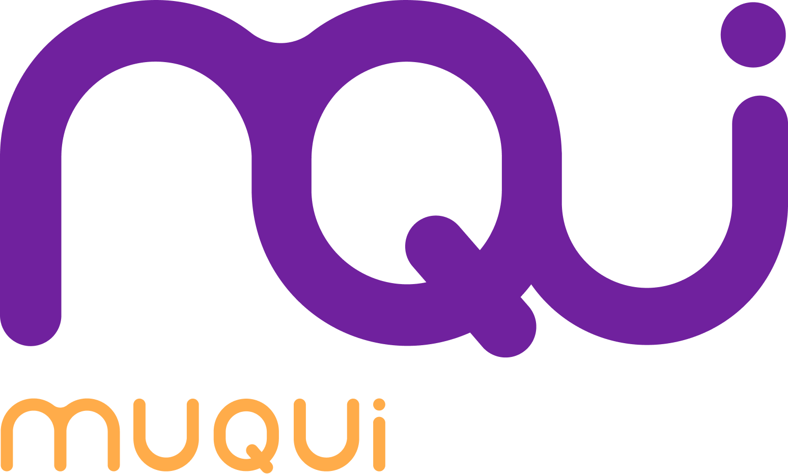

# MUQUI GAME

## [Play the Game!](https://somorales.github.io/muqui-game/)

# Description

Muqui embarks on exciting missions across diverse worlds, where Muqui must collect objects to progress. As Muqui completes each mission, Muqui unlocks new worlds filled with challenging obstacles that will test their skills.

# Main Functionalities

- Select a Muqui.
- Capture space rocks.
- Avoid collisions with meteors.
- Board the spaceship.

# Backlog Functionalities

- A new world
- Add more customization to muqui.
- Add more special effects to the world

# Technologies used

- HTML, CSS, Javascript, DOM Manipulation, Audio, Figma.

# States

- start screen
- game screen 
- game over screen 
- you win screen 
- new world screen 

